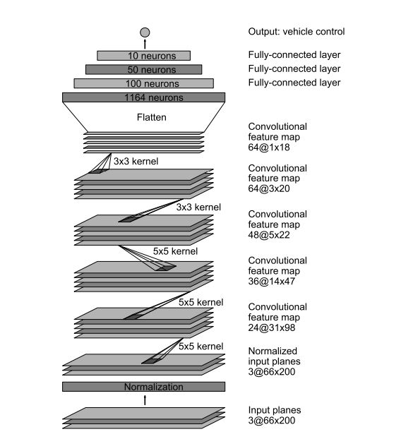
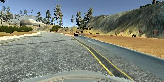
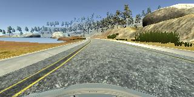
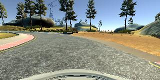
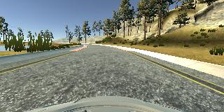

#### Behavioural Cloning.

The objective of this project is to train a model to enable driving of the car around test track in udacity simulator.  
This writeup gives an overview of the file structure, the design consideration that went into the project and results.

##### Folder Structure:
Main files part of this submission are:
- train.py: Implementation of models used for this project.
- imageHandler.py: Helper class to training.
- drive.py : Driving using the trained model.
- model,json: Model architecture config.
- model.h5 : Binary file with trained weights.

##### Running the model:
Model can be tested by executing:  
python drive.py model.h5

##### Model Architecture:
Two different models were looked into during the implementation phase, they were [comma.ai](https://arxiv.org/abs/1608.01230) model and [Nvidia Model](https://images.nvidia.com/content/tegra/automotive/images/2016/solutions/pdf/end-to-end-dl-using-px.pdf)   
As part of final implementation a modified version of nvidia model was used. The nvidia model is shown below.

- RELU Activation was used as activation layer.
- Max pooling was done after each convolutional layer.
- 'same' image padding was used instead of 'valid'.
- As an attempt to reduce over fitting dropout of 0.28 was added before the first fully connected layer.
These changes were done based on driving accuracy on the simulator and was a trial and error approach.
- Though Adam optimizer was used for optimization, it was set to an initial training rate of 0.0001 instead of default.
- An 80: 20 split of randomly shuffle data was used to train and validate image.
- Different epoch were tried during the training: 8, 10, 12, 15 and 8 was finally choosen for best performance of all.

##### Data collection strategy.
- The quality of the collected data had significant impact on the driving accuracy in this project.
- An initial attempt was made to collect extensive data in straight and driving in opposite direction in the track-1. But the model failed on bridge corners.
In the final approach following were the collected data:
- straight-recovery: 20313(including left, center and right camera) images of slow recovery from side.  

- wiggle : 23655 images of fast course correction between the lane lines.  

- recover-unpatched : 2244 images of recovering near special cases of track, including curve after the bridge.  

- center : 20976 image of driving with vehicle on center of the track.  

- Data collection was made with speed in and around 20, also throttle was limited to keep the trained model within speed range of 20.

##### Reducing overfitting:
- Dropout was introduced to reduce overfitting.
- Images were randomly perturbed, images were sheared or flipped randomly to better generalize the model.
- Angle correction were added to the left and right camera images to help in steering recovery.

##### Conclusion:
- A recorded [video](./video.mp4) of the model is part of this submission.
- The model was extremely susceptible to the type of data collected, as such a much more generalized model using transfer learning, from model trained on actual road scenes need to be tried.
- In future, VGG net needs to be tested to see how it fairs on the track.
